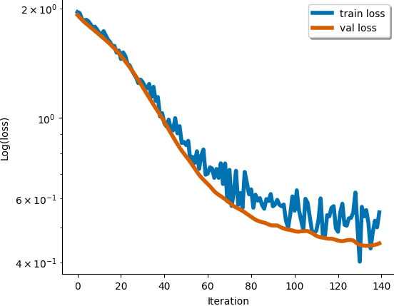
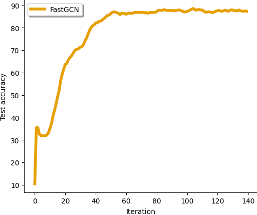

# FastGCN Implementation in PyTorch
---

This repository contains codes which implement the FastGCN algorithm from [FastGCN: Fast Learning with Graph Convolutional Networks via Importance Sampling](https://arxiv.org/abs/1801.10247). Training/experimental differences are highlighted and discussed below to facilitate maximal transparency.


## Installation and Hardware

Please run all commands in the [requirements.txt](requirements.txt) file for installation. This project assumes PyTorch version 1.12.1 (at the time of writing this is the most recent version of PyTorch; visit [here](https://pytorch.org/get-started/previous-versions/) for previous versions).

Experiments are performed on a Quadro RTX 5000.

## Training Details

Here we discuss several training/implementation differences from the original FastGCN paper:

1. **Sampling neighborhood**: it is well known that FastGCN can suffer from choosing nodes that are disconnected at each layer (see [2] below). Hence, we implement a version of FastGCN which chooses nodes at each layer from the set of 1-hop neighbors of the current layer; such a scheme is similar to the LADIES algorithm of [2], but we do not re-compute the adjacency matrix.
2. **Pre-computation**: as remarked in [1], the initial layer of the GCN architecture is fixed relative to the gradient computations; hence we do _not_ perform sampling on the first layer of the GCN, but instead use all neighbor information at this layer (such a scheme is equivalent to pre-computing the initial layer).
3. **Probability scaling**: equation (10) in [1] indicates the each node's update needs to be appropriately scaled when performing a forward pass of the network; since nodes are chosen from the 1-hop neighbors in this implementations (see 1. above), this distribution is no longer the _global_ distribution defined over all of the nodes, but rather the _local_ distribution defined over the set of 1-hop neighbor nodes. Such a subtlety deviates from the mathematical formulation of FastGCN, but results in _significant_ improvement in the area of testing accuracy.
4. **Importance sampling**: we implement importance sampling by using the (squared) 2-norm of each column in the adjacency matrix.
5. **Dataset split**: we follow the practice of [1] in terms of dataset training/validation/testing split: all nodes that do not belong to the testing or validation set are used as training nodes.
6. **Batch/sample size**: all of our tests use a standard 2-layer GCN architecture; for all datasets, we compute the loss over a mini-batch of 256 training nodes and sample 400 nodes at the next layer. Notice there is no sampling after this (even though this is a 2-layer GCN) as we use pre-computation on the input layer.
7. **Other hyperparameters**: we train all models for 200 iterations with the Adam optimizer using a learning rate of 0.01 and employ early stopping if the validation loss does not decrease for 10 iterations. Weight decay is applied ($l_2$ regularization), row features are normalized, and no dropout is applied. For Cora, PubMed, and CiteSeer the hidden dimension is 16. For Reddit, the hidden dimension is 128.

## Results

Testing the code on the Cora dataset with the following command should yield the following output:

```
python fastgcn_test.py --dataset="Cora" --fast="true" --hidden_dim=16 --lr=0.01 --init_batch=256 --sample_size=400

# OUTPUT
========================= STARTING TRAINING =========================
TRAINING INFORMATION:
[DATA] Cora dataset
[FAST] using FastGCN? True
[DEV] device: cuda:0
[ITERS] performing 200 Adam updates
[LR] Adam learning rate: 0.01
[BATCH] batch size: 256
[SAMP] layer sample size: 400

[STOP] early stopping at iteration: 142

RESULTS:
[LOSS] minimum loss: 0.4488450586795807
[ACC] maximum micro F1 testing accuracy: 88.3 %
[TIME] 1.9538 seconds
========================== ENDING TRAINING ==========================
```

Example convergence curves (in terms of loss and accuracy) are given here:




We compare the current approach with the original GCN and report the _maximum testing accuracy_ and the _total_ training time (no inference time is reported) averaged over 3 independent initializations on all datasets besides Reddit (with which we perform 1 trial, due to the timing). Results are reported in the following table:

| Dataset | FastGCN | GCN |
| --- | --- | --- |
| Cora | 88.25% (1.89 s) | 88.3% (1.73 s) |
| CiteSeer | 79.5% (1.35 s) | 79.5% (1.25 s) |
| PubMed | 87.6% (1.79 s) | 88.6% (2.06 s) |
| Reddit | 92.0% (157.01 s) | 94.5% (1050.26 s) |

## References

[1] Jie Chen, Tengfei Ma, and Cao Xiao. [FastGCN: Fast Learning with Graph Convolutional Networks via Importance Sampling](https://arxiv.org/abs/1801.10247). ICLR 2018.

[2] Difan Zou, Ziniu Hu, Yewen Wang, Song Jiang, Yizhou Sun, and Quanquan Gu. [Layer-Dependent Importance Sampling for Training Deep and Large Graph Convolutional Networks](https://proceedings.neurips.cc/paper/2019/file/91ba4a4478a66bee9812b0804b6f9d1b-Paper.pdf). NeurIPS 2021.