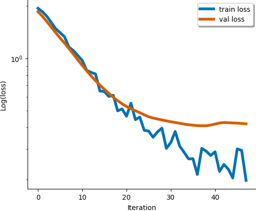
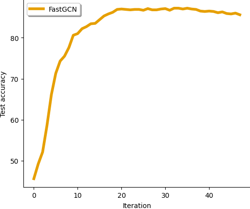

# FastGCN Implementation in PyTorch
---

This repository contains codes which implement the FastGCN algorithm from [FastGCN: Fast Learning with Graph Convolutional Networks via Importance Sampling](https://arxiv.org/abs/1801.10247). Training/experimental differences are highlighted and discussed below to facilitate maximal transparency.


## Installation and Hardware

Please run all commands in the [requirements.txt](requirements.txt) file for installation. This project assumes PyTorch version 1.12.1 (at the time of writing this is the most recent version of PyTorch; visit [here](https://pytorch.org/get-started/previous-versions/) for previous versions).

Experiments are performed on a Quadro RTX 5000 (16 GB memory).

## Training Details

Here we discuss several training/implementation differences from the original FastGCN paper:

1. **Sampling neighborhood**: it is well known that FastGCN can suffer from choosing nodes that are disconnected at each layer (see [2] below). Hence, we implement a version of FastGCN which chooses nodes at each layer from the set of 1-hop neighbors of the current layer and union these nodes with the entire current layer; such a scheme is similar to the LADIES algorithm of [2], but we do not re-compute the adjacency matrix (see line 5 in Algorithm 1 of [2]). Additionally, we sample _without_ replacement in this implementation.
2. **Pre-computation**: as remarked in [1], the initial layer of the GCN architecture is fixed relative to the gradient computations; hence we do _not_ perform sampling on the first layer of the GCN, but instead use all neighbor information at this layer (such a scheme is equivalent to pre-computing the initial layer).
3. **Probability scaling**: equation (10) in [1] indicates the each node's update needs to be appropriately scaled when performing a forward pass of the network; since nodes are chosen from the 1-hop neighbors in this implementations (see 1. above), this distribution is no longer the _global_ distribution defined over all of the nodes, but rather the _local_ distribution defined over the set of 1-hop neighbor nodes. Such a subtlety deviates from the mathematical formulation of FastGCN, but results in _significant_ improvement in the area of testing accuracy.
4. **Importance sampling**: we implement importance sampling by using the (squared) 2-norm of each column in the adjacency matrix.
5. **Dataset split**: we follow the practice of [1] in terms of dataset training/validation/testing split: all nodes that do not belong to the testing or validation set are used as training nodes.
6. **Batch/sample size**: all of our tests use a standard 2-layer GCN architecture; for all datasets, we compute the loss over a mini-batch of 256 training nodes and sample 400 nodes at the next layer (except for Reddit, which uses a mini-batch of 1024 and samples 5120 nodes at the next layer). Notice there is no sampling after this (even though this is a 2-layer GCN) as we use pre-computation on the input layer.
7. **Other hyperparameters**: we train all models for 200 iterations with the Adam optimizer using a learning rate of 0.01 and employ early stopping if the validation loss does not decrease for 10 iterations (20 in the case of Reddit). Weight decay is applied (l_2 regularization), row features are normalized only for PubMed, and no dropout is applied. For Cora, PubMed, and CiteSeer the hidden dimension is 16. For Reddit, the hidden dimension is 128.
8. **Inference**: we perform inference using all of the nodes in the network (i.e. a forward pass of the un-batched GCN model is used to perform inference); this is done for both computing the validation loss and computing the testing accuracy.

##### OGB-Update (2023)

We have added experiments from the [OGB dataset collection](https://ogb.stanford.edu). We use both the arxiv and products datasets to demonstrate that this implementation is scalable. Several modifications were needed for the original [fastgcn_model.py](models/fastgcn_model.py) file to make the implementations more efficient; those modifications are included in the new file [updated_fastgcn_model.py](models/updated_fastgcn_model.py).

We follow the [OGB GCN implementations](https://github.com/snap-stanford/ogb/tree/master/examples/nodeproppred) to create the GCN models. For both datsets, we use a 3-layer GCN architecture with hidden dimension 256 and for the arxiv dataset we additionally use batch normalization after each of the inner layers. Each dataset is trained with mini-batches of size 1024; for arxiv we use a sample size of 10240 and for products we use 15360 (we additionally introduce an argument `--scale_factor` which allows for deeper architectures to sample more neighbors at deep layers, we set this to be 5 for arxiv and 1 for products).

We run each dataset to 1000 iterations (no early stopping is used). Inference is reported intermittently (with the new `--report` argument) for mini-batch inference; for arxiv we report every 10 iterations and for products we report every 250. We only perform 1 trial for each run (due to long inference times). Please note that the mini-batch inference for arxiv is highly irregular. It is best to use `--report=1`, although this is slow.

## Results

Testing the code on the Cora dataset with the following command should yield the following output:

```
python3 fastgcn_test.py --dataset='Cora' --fast="true" --hidden_dim=16 --norm_feat="false" --lr=0.01 --init_batch=256 --sample_size=400

# OUTPUT
========================= STARTING TRAINING =========================
TRAINING INFORMATION:
[DATA] Cora dataset
[FAST] using FastGCN? True
[INF] using sampling for inference? False
[FEAT] normalized features? False
[DEV] device: cuda:0
[ITERS] performing 200 Adam updates
[LR] Adam learning rate: 0.01
[BATCH] batch size: 256
[SAMP] layer sample size: 400

[STOP] early stopping at iteration: 57

RESULTS:
[LOSS] minimum loss: 0.14825539290905
[ACC] maximum micro F1 testing accuracy: 87.8 %
[TIME] 0.7757 seconds
========================== ENDING TRAINING ==========================
```

Example convergence curves (in terms of loss and accuracy) are given here:




We compare the current approach with the original GCN and report the _maximum testing accuracy_, the _per-iteration_ training time, and the _total_ training time (no inference time is reported) averaged over 3 independent initializations on all datasets besides Reddit (with which we perform 1 trial, due to the timing). The final column uses sampling in the inference phase as in [3], where the batch size is kept the same as in the training phase, but the sampled size at the second layer is 1280, 2560, 2560, and 15360, respectively. Results are reported in the following table:

```
|          | FastGCN (full-batch inference) | GCN (full-batch inference) | FastGCN (mini-batch inference) |
| Dataset  | acc     | per-batch  | total   | acc   | per-batch | total  | acc     | per-batch  | total   |
| -------- | ------- | ---------- | ------- | ----- | --------- | ------ | ------- | ---------- | ------- |
| Cora     | 87.5%   | 0.0071s    | 0.77s   | 87.0% | 0.0048s   | 0.58s  | 87.9%   | 0.0071s    | 0.77s   |
| CiteSeer | 78.4%   | 0.0071s    | 0.58s   | 78.7% | 0.0049s   | 0.47s  | 79.3%   | 0.0071s    | 0.56s   |
| PubMed   | 88.3%   | 0.0075s    | 1.27s   | 88.5% | 0.0053s   | 1.4s   | 88.3%   | 0.0075s    | 1.3s    |
| Reddit   | 94.5%   | 0.1663s    | 33.3s   | 94.8% | 1.61s     | 323.6s | 92.7%   | 0.169s     | 21.03s  |
| arxiv    | 71.6%   | 0.2031s    | 203.1s  | 71.6% | 0.258s    | 258.1s | 70.0%   | 0.205s     | 204.7s  |
| products | OOM     | N/A        | N/A     | OOM   | N/A       | N/A    | 75.9%   | 0.4804s    | 480.4s  |
```

#### Command line instructions

To reproduce the above table, please run the commands below. The 'Command (full-batch inference)' commands will reproduce the values from the first column above; changing the respective argument to `--fast='false'` will reproduce the second; and adding the arguments from the 'mini-batch inference' column will reproduce the third column above (**note**: `--fast='true'` in this case).

| Dataset   | Command (full-batch inference)                                                                                                                                                                                                                                   | mini-batch inference |
|-----------|------------------------------------------------------------------------------------------------------------------------------------------------------------------------------------------------------------------------------------------------------------------| --- |
| Cora      | ```python3 fastgcn_test.py --dataset='Cora' --norm_feat='false' --fast='true' --hidden_dim=16 --init_batch=256 --sample_size=400 --early_stop=10 --wd=5e-4```                                                                                                    | ```--samp_inference='true' --inference_init_batch=256 --inference_sample_size=1280``` |
| CiteSeer  | ```python3 fastgcn_test.py --dataset='CiteSeer' --norm_feat='false' --fast='true' --hidden_dim=16 --init_batch=256 --sample_size=400 --early_stop=10 --wd=5e-4```                                                                                                | ```--samp_inference='true' --inference_init_batch=256 --inference_sample_size=2560``` |
| PubMed    | ```python3 fastgcn_test.py --dataset='PubMed' --norm_feat='true' --fast='true' --hidden_dim=16 --init_batch=256 --sample_size=400 --early_stop=10 --wd=5e-4```                                                                                                   | ```--samp_inference='true' --inference_init_batch=256 --inference_sample_size=2560``` |
| Reddit    | ```python3 fastgcn_test.py --dataset='Reddit' --norm_feat='false' --fast='true' --hidden_dim=128 --init_batch=1024 --sample_size=5120 --early_stop=20 --wd=1e-4```                                                                                               | ```--samp_inference='true' --inference_init_batch=1024 --inference_sample_size=15360``` |
| arxiv     | ```python3 fastgcn_test.py --dataset='ogbn-arxiv' --norm_feat='false' --fast='true'  --init_batch=1024 --sample_size=10240 --early_stop=-1 --wd=0.0  --batch_norm='true' --hidden_dim=256 --num_layers=2 --drop=0.5 --scale_factor=5 --epochs=1000 --lr=0.001``` | ```--samp_inference='true' --inference_init_batch=8192 --inference_sample_size=169343 --report=10``` |
| products* | ```python3 fastgcn_test.py --dataset='ogbn-products' --norm_feat='false' --fast='true'  --init_batch=1024 --sample_size=15360 --early_stop=-1 --wd=0.0  --batch_norm='false' --hidden_dim=256 --num_layers=2 --drop=0.5 --scale_factor=1 --epochs=1000 --lr=0.01```             | ```--samp_inference='true' --inference_init_batch=32768 --inference_sample_size=491520 --report=250``` |

*Full-batch inference for the products dataset runs out of memory; please use the last column above to measure accuracy. The cost of performing inference on the products dataset is large because a majority of the data is testing data [4]. A GPU with higher memory can perform full-batch inference for this dataset [4].


## References

[1] Jie Chen, Tengfei Ma, and Cao Xiao. [FastGCN: Fast Learning with Graph Convolutional Networks via Importance Sampling](https://arxiv.org/abs/1801.10247). ICLR 2018.

[2] Difan Zou, Ziniu Hu, Yewen Wang, Song Jiang, Yizhou Sun, and Quanquan Gu. [Layer-Dependent Importance Sampling for Training Deep and Large Graph Convolutional Networks](https://proceedings.neurips.cc/paper/2019/file/91ba4a4478a66bee9812b0804b6f9d1b-Paper.pdf). NeurIPS 2021.

[3] Tim Kaler, Nickolas Stathas, Anne Ouyang, Alexandros-Stavros Iliopoulos, Tao B. Schardl, Charles E. Leiserson, and Jie Chen. [Accelerating Training and Inference of Graph Neural Networks with Fast Sampling and Pipelining](https://arxiv.org/pdf/2110.08450.pdf). MLSys Conference 2022.

[4] Weihua Hu, Matthias Fey, Marinka Zitnik, Yuxiao Dong, Hongyu Ren, Bowen Liu, Michele Catasta, and Jure Leskovec. [Open Graph Benchmark: Datasets for Machine Learning on Graphs](https://papers.neurips.cc/paper/2020/file/fb60d411a5c5b72b2e7d3527cfc84fd0-Paper.pdf). NeurIPS 2020.
